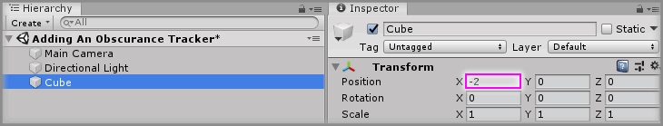
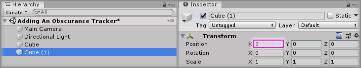
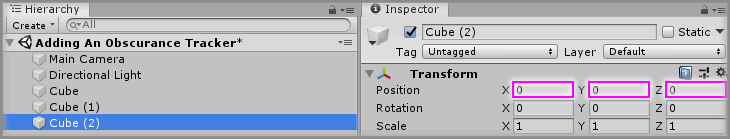
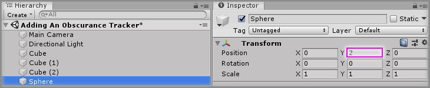
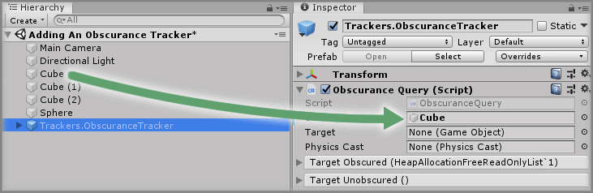
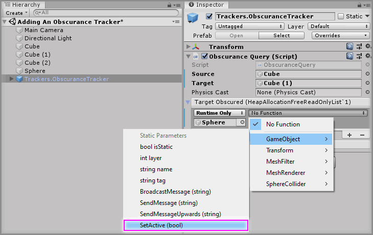
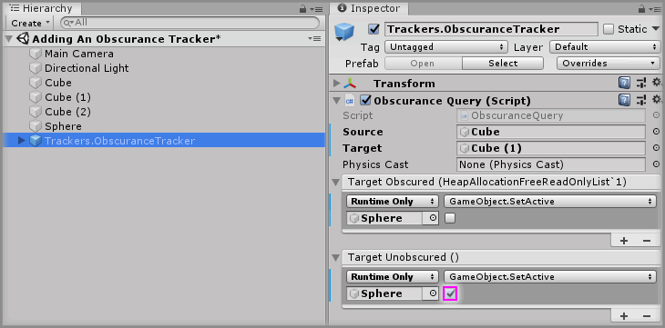
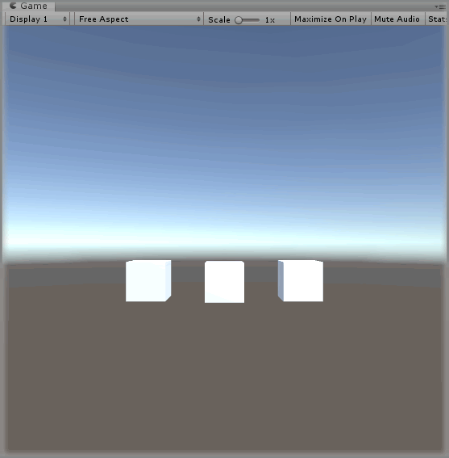

# Adding An Obscurance Tracker

> * Level: Beginner
>
> * Reading Time: 5 minutes
>
> * Checked with: Unity 2018.3.14f1

## Introduction
The `Obscurance Tracker` prefab enables you to toggle the state of an object between being present or invisible based a GameObject obscuring the view between two other GameObjects.

## Prerequisites

* [Install the Tilia.Trackers.ObscuranceTracker.Unity] package dependency in to your [Unity] project.

## Let's Start

### Step 1

Create a new `Cube` Unity 3D Object by selecting `Main Menu -> GameObject -> 3D Object -> Cube` and change the `Transform` properties to:

* Position: `X = -2`, `Y = 0`, `Z = 0`

### Step 2

Create a new `Cube` Unity 3D Object by selecting `Main Menu -> GameObject -> 3D Object -> Cube` and change the `Transform` properties to:

* Position: `X = 2`, `Y = 0`, `Z = 0`

### Step 3

Create a new `Cube` Unity 3D Object by selecting `Main Menu -> GameObject -> 3D Object -> Cube` and change the `Transform` properties to:

* Position: `X = 0`, `Y = 0`, `Z = 0`

### Step 4

Create a new `Sphere` Unity 3D Object by selecting `Main Menu -> GameObject -> 3D Object -> Sphere` and change the `Transform` properties to:

* Position: `X = 0`, `Y = 2`, `Z = 0`

### Step 5

Expand the `Tilia Trackers ObscuranceTracker Unity` package directory in the Unity Project window and select then `Packages -> Tilia Trackers ObscuranceTracker Unity -> Runtime -> Prefabs` directory then drag and drop the `Trackers.ObscuranceTracker` prefab into the Unity Hierarchy window.

### Step 6

Drag and drop the `Cube` GameObject from the Unity Hierarchy window into the `Source` parameter on the `Obscurance Query` component.

### Step 7

Drag and drop the `Cube (1)` GameObject from the Unity Hierarchy window into the `Target` parameter on the `Obscurance Query` component.

### Step 8

Select the `Trackers.ObscuranceTracker` GameObject from the Unity Hierarchy window and click the `+` symbol in the bottom right corner of the `Target Obscured` event parameter on the `Obscurance Query` component.

Drag and drop the `Sphere` GameObject into the event listener box that appears on the `Target Obscured` event parameter on the `Obscurance Query` component that displays `None (Object)`.

Select a function to perform when the `Target Obscured` event is emitted. For this example, select the `GameObject -> SetActive(bool)` function (be sure not to select `Dynamic bool - SetActive` for this example).

### Step 9

Do the same as [Step 8] but for the `Target Unobscured` event parameter in the `Obscurance Query` component, but tick the checkbox on the `GameObject -> SetActive(bool)` function.

### Done

Play the Unity scene and you will notice that the `Sphere` GameObject disappears, this is because `Cube` does not have direct line of sight on `Cube (1)` because `Cube (2)` is in the way and obscuring the view.

This causes the `Target Obscured` event to emit, which we've set to disable our `Sphere` GameObject.

Now just select the `Cube (2)` GameObject in the Unity Hierarchy window and change the `Transform` properties to:

* Position: `X = 0`, `Y = -2`, `Z = 0`

And now `Cube` does have direct line of sight of `Cube (1)` so the target is no longer obscured and the `Sphere` GameObject will become active.

[Install the Tilia.Trackers.ObscuranceTracker.Unity]: ../Installation/README.md
[Unity]: https://unity3d.com/
[Step 8]: #step-8